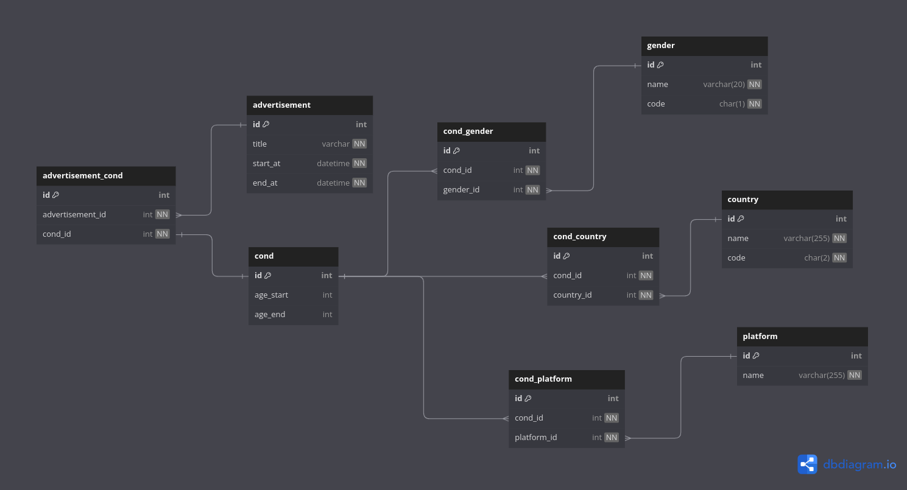
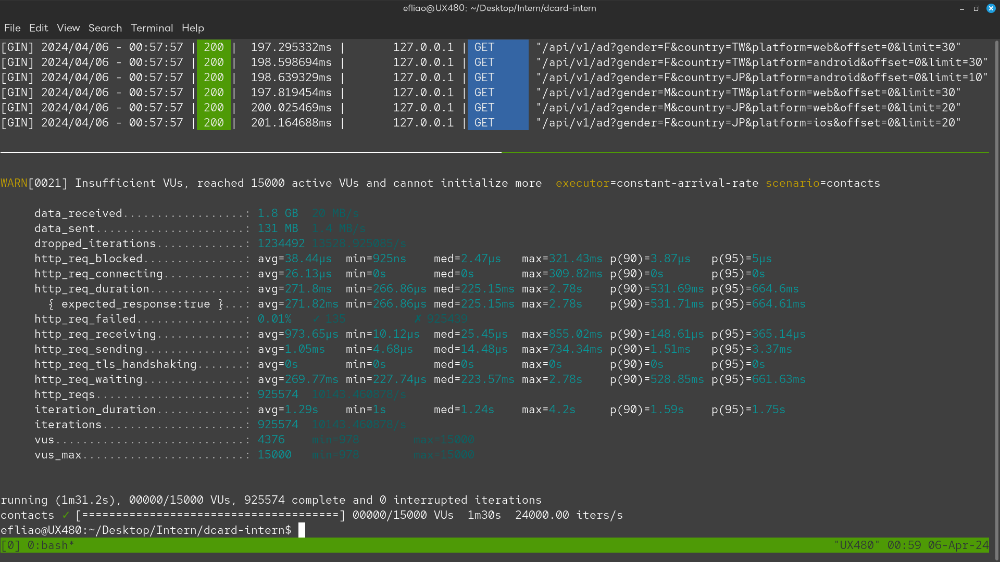

# 2024 Backend Intern Assignment (Dcard)

## About The Project

### Built With
- Golang 1.22.1 (gin, go-redis, sqlc, go-swagger)
- MySQL 8.0.36
- Redis 7.2.4
- k6 v0.50.0

## Getting Started

To run the app, follow these steps:

1. Add your application configuration to `.env` file in the root of the project:

```sh
# at .env
MYSQL_ROOT_PASSWORD=
MYSQL_DATABASE=
MYSQL_USER=
MYSQL_PASSWORD=
```

2. Build and run the app using Docker Compose:

```sh
docker compose --profile prod up --build
```

3. Access the API endpoint at `localhost:8080/api/v1/ad`

4. For Swagger API documentation, visit `localhost:8080/api/v1/swagger/index.html`

5. To shut down the docker environment, run:

```sh
docker compose --profile prod down -v
```

## Database Design



## Load Testing with Grafana k6

```
cd k6
python pre.py # create fake advertisements
k6 run script.js
```



## Development

For development purposes, follow these steps:

1. Start the Docker environment (database & cache)

```sh
docker compose up -d
```

2. Navigate to the app directory and run the application in development mode:

```sh
cd app
go run . -mode dev
```

Now, you can make changes to the code and test them locally.
